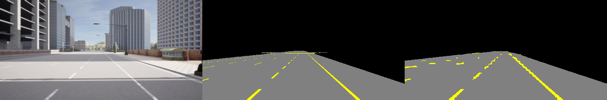

# CARLA Lane Segmentation

Semantic segmentation for autonomous-driving perception in the
[CARLA](https://carla.org/) simulator. The model segments each camera
pixel into **drivable road**, **lane marking**, or **background**, and the
project measures how well that perception **generalizes to unseen maps and
weather** — not just whether it works on the training condition.

This is a personal research project built to study the perception stage of
an autonomous-driving pipeline end to end: synchronized data collection,
automatic ground-truth labeling, model training, and quantitative
per-class evaluation, developed through a series of hypothesis-driven
experiments.

> **Status:** active. The current milestone is an enhanced baseline trained
> on 45,000 frames across 6 maps and 10 weather types, with a measured
> generalization benchmark on a held-out map.

---

## Highlights

- **Fully automatic labeling.** Ground-truth masks come directly from
  CARLA's semantic-segmentation camera — no manual annotation. Collection
  runs in **synchronous mode**, so every RGB frame and its label mask
  correspond to the same simulation tick.
- **Generalization is measured, not assumed.** Evaluation is on a fully
  held-out map (Town05) across multiple weather conditions, with per-class
  IoU, to show where perception holds and where it breaks.
- **Robust large-scale collection.** A batch runner collects 30 map/weather
  sets unattended: it manages the CARLA server per set (restarting it to
  avoid long-run memory leaks), resumes after interruptions, isolates
  failures, and filters out stationary (red-light) frames.
- **Reproducible.** Datasets and weights are not committed (large,
  regenerable); scripts + a downloadable dataset reproduce everything.

---

## Key result: generalization improved through three experiments

Target metric: **lane IoU on an unseen map (Town05)** — the hardest class.

| Experiment | Training data | Unseen-map lane IoU |
|---|---|---|
| 1. Single condition | Town03 ClearNoon, 500 | 0.100 |
| 2. Map diversity | 3 maps ClearNoon, 1,500 | 0.128 |
| 3. Enhanced baseline | 6 maps x 10 weather, 45,000 | **0.492** |

Experiment 3 (current baseline), evaluated on the held-out map Town05:

| Eval condition | Road IoU | Lane IoU | mIoU |
|---|---|---|---|
| Town05 / ClearNoon | 0.934 | 0.492 | 0.807 |
| Town05 / HardRain  | 0.954 | 0.561 | 0.833 |
| Town05 / ClearSunset | 0.941 | 0.491 | 0.808 |

**Key findings:** scaling data volume and adding weather diversity raised
unseen-map lane IoU nearly 4x over map-diversity alone; the rain condition,
previously the weakest, became the strongest — a learned weather condition
transferred to a new map. Full analysis, including an honest note on
eval-set comparability, is in
[`baseline_comparison.md`](baseline_comparison.md).

### Prediction example

Left to right: input RGB, ground-truth mask, model prediction
(gray = road, yellow = lane, black = background).



---

## Pipeline

```
run_collection.py  ->  train.py  ->  evaluate.py / predict.py
 (30 sets, robust)     (DeepLabV3)    (per-class IoU / visualization)
```

| Script | Role |
|---|---|
| `src/collect_data.py` | Collects one map/weather set (synchronous mode, speed filter). Runnable standalone or by the batch runner. |
| `src/run_collection.py` | Batch runner: collects all sets in `configs/sets.yaml`, managing the server per set, with resume + failure isolation. |
| `src/dataset.py` | PyTorch `Dataset`: loads RGB/label pairs across one or many folders; remaps CARLA class IDs to 3 classes. |
| `src/model.py` | DeepLabV3 (ResNet-50) with the output layer replaced for 3 classes. |
| `src/train.py` | Training with class-weighted loss, best-model saving, and early stopping. |
| `src/evaluate.py` | Confusion-matrix per-class IoU / mIoU on a dataset. |
| `src/predict.py` | Inference on one sample -> RGB / ground-truth / prediction image. |
| `configs/sets.yaml` | The 30 map/weather sets that make up the training grid. |

---

## Setup

- CARLA 0.9.16, Python 3.10, PyTorch (CUDA build)
- NVIDIA GPU (developed on RTX 4080, 16 GB)

```bash
pip install -r requirements.txt
cp configs/config.example.yaml configs/config.yaml   # then edit values
```

## Data

The dataset (45,000 training frames + held-out Town05 evaluation sets) is
hosted externally and not stored in this repo. Download and extract it into
`dataset/`. *(Link added once uploaded — see baseline_comparison.md for the
exact set list, which mirrors `configs/sets.yaml`.)*

To regenerate instead of downloading: start the CARLA server and run
`python src/run_collection.py` (training sets), then collect the Town05
evaluation sets via `configs/config.yaml`'s `collect:` section.

## Train / evaluate

```bash
python src/train.py       # trains on configs/config.yaml train.data_dirs
python src/evaluate.py    # set eval.eval_dir to a Town05 set
python src/predict.py     # visualize one prediction
```

---

## Roadmap

- [x] Establish single-condition baseline and quantify its generalization gap.
- [x] Test the map-diversity hypothesis.
- [x] Scale data + weather diversity into an enhanced baseline (45k frames).
- [ ] Increase input resolution to recover thin lane structure.
- [ ] Re-evaluate earlier models on the new eval set (controlled comparison).
- [ ] Extend conditions (night, fog); connect perception to planning.